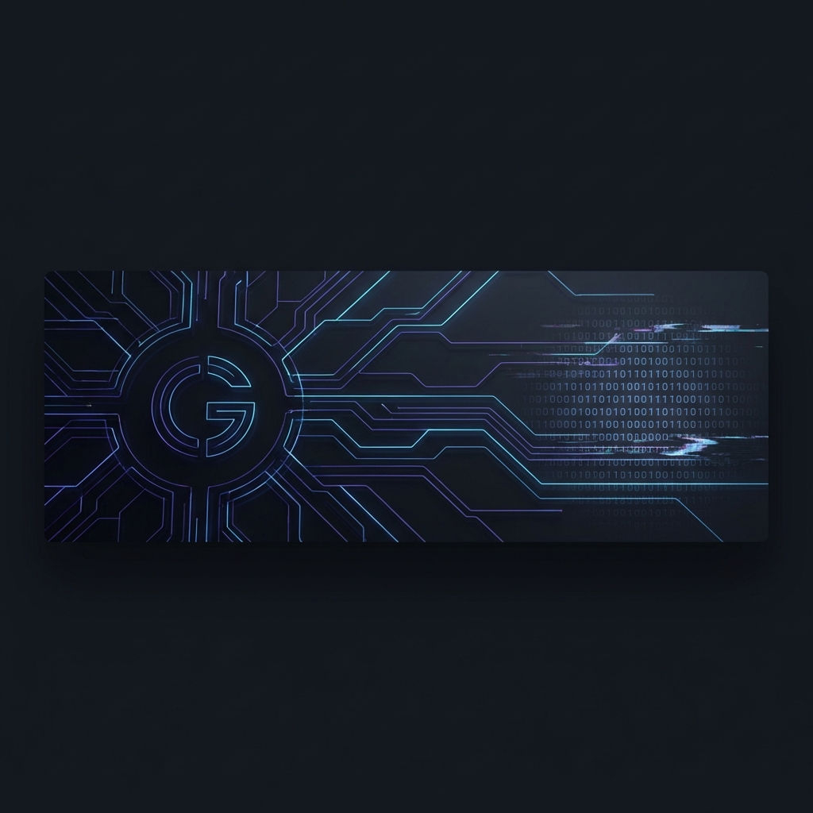

<div align="center">

# ⚡ CHETAN GAVALI
### **Engineer | Security Researcher | Full-Stack Architect**



<p align="center">
  
  
  
</p>

---

### �️ **EXECUTIVE SUMMARY**

I specialize in the intersection of **Cybersecurity Architecture** and **Modern Web Systems**. As a Computer Science Engineering student, I bridge the gap between building high-performance applications and ensuring they are resilient against evolving threat landscapes. My philosophy is simple: **Security is not a feature; it is the foundation.**

</div>

<br />

<table align="center">
  <tr>
    <td width="50%" valign="top">
      <h4>⚡ CORE SPECIALIZATIONS</h4>
      <ul>
        <li><b>Offensive Security:</b> Penetration testing, Vulnerability Assessment (VAPT), OWASP Top 10.</li>
        <li><b>Full-Stack Engineering:</b> Scalable microservices, Real-time systems, Cloud-native apps.</li>
        <li><b>IoT & Embedded:</b> Secure firmware development, Edge computing, ESP32 ecosystem.</li>
        <li><b>Network Defense:</b> Traffic analysis, Firewall orchestration, Secure protocols.</li>
      </ul>
    </td>
    <td width="50%" valign="top">
      <h4>🚀 CURRENT INITIATIVES</h4>
      <ul>
        <li>Developing advanced <b>AI-driven Security Tools</b> for automated threat detection.</li>
        <li>Researching <b>Zero-Trust Architectures</b> in IoT mesh networks.</li>
        <li>Optimizing <b>DevSecOps pipelines</b> for seamless secure deployments.</li>
        <li>Contributing to open-source **Cybersecurity Frameworks**.</li>
      </ul>
    </td>
  </tr>
</table>

---

### 🛠️ **TECH ARSENAL**

<div align="center">

| CATEGORY | TECH STACK |
| :--- | :--- |
| **LANGUAGES** | <p align="left"></p> |
| **DEVELOPMENT** | <p align="left"></p> |
| **SECURITY & OPS** | <p align="left"></p> |

</div>

---

### 📊 **GitHub PERFORMANCE**

<div align="center">


<br />


</div>

---

### 🌐 **NETWORK & COLLABORATION**

<div align="center">

<a href="https://linkedin.com/in/chetanngavali"></a>
<a href="https://twitter.com/chetanngavali"></a>
<a href="mailto:chetanngavali@gmail.com"></a>
<a href="https://github.com/sponsors/chetanngavali"></a>

<br />

```bash
# Initialize connection...
printf "Always innovating. Secure by design."
```

Built with ⚡ by **Chetan Gavali**
</div>
