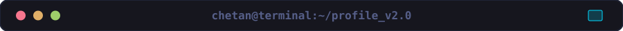

**root.chetan:~$ whoami**

**Ethical Hacker | Cybersecurity Researcher | Full-Stack Developer**

Specializing in uncover deep vulnerabilities in IoT and wireless protocols.

 

  

**root.chetan:~$ ls capabilities/**

  

**root.chetan:~$ ls projects/**

<table width="100%">
<tr>
<td width="50%" align="center" valign="top">

### 🛡️ EVIL_TWINS_ESP8266
  

**Wi-Fi MITM Rogue Access Point framework.**

[**🚀 Launch Project**](https://github.com/chetanngavali/ESP8266-Evil-Twin-Project)

</td>
<td width="50%" align="center" valign="top">

### 🔐 secure_stego

**AEAD-encrypted image steganography.**

[**🔑 View Repository**](https://github.com/chetanngavali/secure_stego)

</td>
</tr>
</table>

 

**root.chetan:~$ cat awards.log**

| 🏅 | Event | Recognition |
|:---:|:---|:---:|
| 🥇 | **Mind Spark 2024** | **1st Place Winner** |
| 🛡️ | **Hack4Innovation 2026** | **Finalist** |
| 🚀 | **PCU's Ideathon 3.0** | **Finalist** |

 

 

**root.chetan:~$ cat certs.txt**

**[✔] ISO/IEC 27001:2022 Information Security Associate™**  
**[✔] Cybersecurity Fundamentals** — Reliance  
**[✔] Bug Bounty Methodology** — Knight Secured  
**[✔] Certified C++ Practitioner (94%)** — Red Team Leaders  
**[✔] Frontend Developer (React)** — HackerRank  
**[✔] Hash Cracker** — TryHackMe  
**[✔] Kali Linux for Ethical Hackers** — Udemy  
**[✔] Technology Job Simulation** — Deloitte Australia  

 

**root.chetan:~$ cat contact.txt**

**[!] Connection established. Ready to collaborate.**  
[**LinkedIn**](https://www.linkedin.com/in/chetanngavali/) · [**GitHub**](https://github.com/chetanngavali) · [**Email**](mailto:chetangavali@protonmail.com)

---

## 🐍 Contribution Snake

  <picture>
    <source media="(prefers-color-scheme: dark)" srcset="https://raw.githubusercontent.com/chetanngavali/chetanngavali/output/github-contribution-grid-snake-dark.svg">
    <source media="(prefers-color-scheme: light)" srcset="https://raw.githubusercontent.com/chetanngavali/chetanngavali/output/github-contribution-grid-snake.svg">
    
  </picture>

---

  

